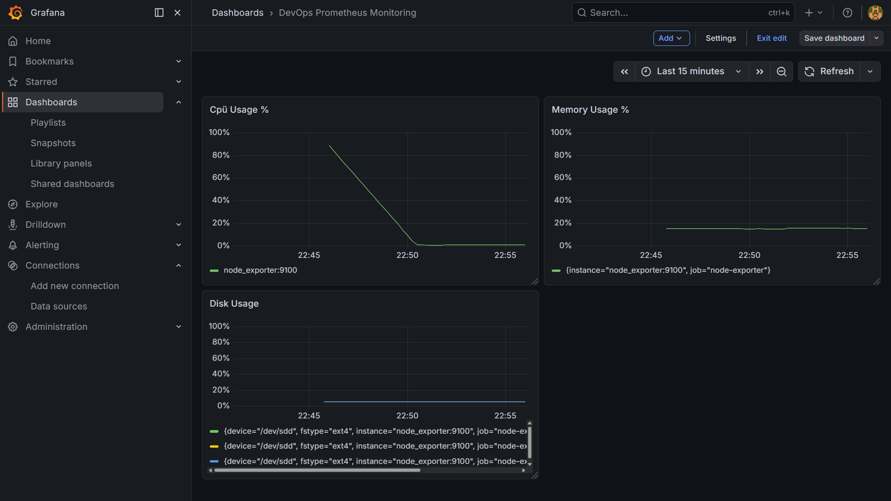

# Production-Ready DevOps Stack

[](https://github.com/2021Eugene/production-ready-devops-stack/actions/workflows/ci.yml)
[](https://github.com/2021Eugene/production-ready-devops-stack/actions/workflows/trivy.yml)

## Overview

This project is a small DevOps-style containerized stack built with Docker Compose.

It includes:
- a custom application container built from `docker/app/Dockerfile`
- an Nginx reverse proxy
- a PostgreSQL database
- environment-based configuration using `.env`
- persistent database storage with Docker volumes
- a custom Docker network for inter-service communication
- PostgreSQL healthcheck
- resource limits for services
- GitHub Actions CI validation
- Prometheus monitoring
- Grafana dashboards
- Node Exporter system metrics
- PostgreSQL Exporter database metrics
- GitHub Actions Trivy security scan
- GitHub Actions basic CD workflow

The goal of this project is to demonstrate practical DevOps fundamentals:
- container orchestration with Docker Compose
- reverse proxy configuration
- service separation
- environment-based configuration
- Docker image build validation
- healthchecks and service control
- monitoring and observability
- clean Git history
- production-oriented project structure

## Features

- Multi-container Docker Compose setup
- Custom application image build from `docker/app/Dockerfile`
- Nginx reverse proxy for incoming HTTP traffic
- PostgreSQL 15 with persistent named volume
- Environment-based configuration using `.env`
- Custom Docker network for service communication
- PostgreSQL healthcheck with `pg_isready`
- Resource limits for application services
- GitHub Actions CI for Docker Compose validation
- GitHub Actions CI for Docker image build validation
- Prometheus service for metrics collection
- Grafana service for dashboards and visualization
- Node Exporter for host and system metrics
- PostgreSQL Exporter for database metrics
- GitHub Actions Trivy security scan for container vulnerabilities
- GitHub Actions manual CD workflow simulation

## Tech Stack

- Docker
- Docker Compose
- Nginx
- PostgreSQL 15
- Prometheus
- Grafana
- Node Exporter
- GitHub Actions
- WSL2
- VS Code
- Git / GitHub

## Project Structure

```text
production-ready-devops-stack/
├── .github/
│   └── workflows/
│       ├── ci.yml
│       ├── trivy.yml
│       └── cd.yml
├── docker/
│   ├── app/
│   │   ├── Dockerfile
│   │   └── index.html
│   └── nginx/
│       └── nginx.conf
├── docs/
│   └── images/
│       └── GrafanaDashboard.png
├── monitoring/
│   └── prometheus/
│       └── prometheus.yml
├── .env.example
├── .gitignore
├── docker-compose.yml
├── LICENSE
└── README.md
```

## Architecture Diagram

```text
Browser
   |
   v
Nginx Reverse Proxy
   |
   v
Custom App Container
   |
   v
PostgreSQL Database

Monitoring:
Node Exporter --> Prometheus --> Grafana
PostgreSQL Exporter --> Prometheus --> Grafana

Configuration:
.env.example -> .env -> PostgreSQL

CI / CD / Security:
GitHub Actions
 ├─ Docker Compose validation
 ├─ Docker image build validation
 ├─ Trivy security scan
 └─ Manual CD workflow simulation
```

## How to Run

### 1. Clone the repository

```bash
git clone https://github.com/2021Eugene/production-ready-devops-stack.git
cd production-ready-devops-stack
```

### 2. Create environment file

Create a local `.env` file in the project root:

```env
POSTGRES_USER=devops
POSTGRES_PASSWORD=your_password
POSTGRES_DB=appdb
```

You can use `.env.example` as a template.

### 3. Start the stack

```bash
docker compose up --build -d
```

### 4. Verify running containers

```bash
docker ps
```

### 5. Open in browser

```text
Application:   http://localhost:8080
Prometheus:    http://localhost:9090
Grafana:       http://localhost:3000
Node Exporter: http://localhost:9100/metrics
```

## Services

### app
A custom lightweight application container built from `docker/app/Dockerfile`.

### nginx
Acts as a reverse proxy and forwards incoming requests to the application container.

### postgres
Provides persistent PostgreSQL storage using a named Docker volume.

### postgres-exporter
Exports PostgreSQL metrics for Prometheus monitoring.

### prometheus
Collects and stores metrics from configured targets.

### grafana
Provides dashboards and visualization for Prometheus metrics.

### node_exporter
Exports system metrics for monitoring.

## Environment Variables

The PostgreSQL service uses environment variables from the local `.env` file:

- `POSTGRES_USER`
- `POSTGRES_PASSWORD`
- `POSTGRES_DB`

The repository includes `.env.example`, while `.env` is ignored via `.gitignore`.

## Healthcheck

The PostgreSQL service includes a healthcheck using `pg_isready`.

This allows Docker to verify whether the database is ready to accept connections.

## Monitoring

This project includes:

- Prometheus for metrics collection
- Grafana for dashboards and visualization
- Node Exporter for system metrics
- PostgreSQL Exporter for database metrics

The monitoring stack is configured to expose and visualize:
- CPU usage
- Memory usage
- Disk usage
- PostgreSQL Up
- PostgreSQL Active Connections

### Dashboard Example



> Note: In WSL2 + Docker environments, disk metrics can vary depending on filesystem visibility and mount propagation.

## CI

This project includes a GitHub Actions workflow located at:

```text
.github/workflows/ci.yml
```

The CI pipeline currently validates:

- Docker Compose configuration
- Docker image build process

## Security

This project includes a dedicated GitHub Actions workflow located at:

```text
.github/workflows/trivy.yml
```
The security workflow:

- builds the custom application image
- scans the image with Trivy
- fails on HIGH and CRITICAL vulnerabilities

## CD

This project includes a basic GitHub Actions CD workflow located at:

```text
.github/workflows/cd.yml
```
The CD workflow:

- is triggered manually with workflow_dispatch
- builds the custom application image
- simulates a deployment stage

## Current Status

Implemented:

- Docker Compose multi-container setup
- Custom application container
- Nginx reverse proxy
- PostgreSQL with persistent volume
- Custom Docker network
- .env-based configuration
- PostgreSQL healthcheck
- Resource limits
- GitHub Actions CI
- CI status badge
- Prometheus monitoring
- Grafana dashboards
- Node Exporter metrics
- PostgreSQL Exporter metrics
- Trivy container security scan
- Architecture diagram
- Improved `.gitignore`
- Basic CD workflow simulation
- Project README and setup guide

## Next Steps

Planned improvements:

- extend CI pipeline with additional validation
- improve monitoring coverage for reverse proxy
- add final dashboard screenshots to the repository

## Notes

This project is being built step by step as a hands-on DevOps portfolio project.
